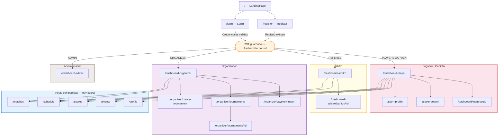

# TECHCUP FÚTBOL

> [!IMPORTANT]
> Este repositorio contiene el *FrontEnd* de la plataforma.

> [!NOTE]
> Interfaz web que permite a organizadores, capitanes, árbitros y jugadores interactuar con la plataforma: gestionar torneos, equipos, partidos, resultados y perfiles deportivos desde un solo lugar.

> 📋 Para convenciones de ramas, commits, seguridad y CI/CD consulta el [README general de la organización](https://github.com/techcup-futbol-dosw).

---

## Tabla de contenido

- [Descripción general](#descripción-general)
- [Stack tecnológico](#stack-tecnológico)
- [Estructura del proyecto](#estructura-del-proyecto)
- [Configuración local](#configuración-local)
- [Modelación y diagramas](#modelación-y-diagramas)
- [Funcionalidades](#funcionalidades)
- [Conexión con el backend](#conexión-con-el-backend)
- [Manejo de errores](#manejo-de-errores)
- [Pruebas y calidad](#pruebas-y-calidad)
- [Gestión del proyecto](#gestión-del-proyecto)
- [CI/CD y Despliegue](#cicd-y-despliegue)
- [Demo](#demo)

---

## Descripción general

### Resumen

Aplicación web desarrollada en **React + TypeScript** que consume los microservicios del ecosistema TechCup Fútbol a través del API Gateway. Permite a los distintos actores del sistema interactuar con la plataforma desde una interfaz centralizada, responsiva y organizada por roles.

La app implementa autenticación JWT con renovación automática de tokens (refresh), rutas protegidas por rol y permiso, y una arquitectura modular donde cada equipo de desarrollo tiene su propio módulo aislado dentro de `src/modules/`.

### Alcance

#### Incluye
- Autenticación con JWT (login, registro, cierre de sesión, refresh automático).
- Dashboard diferenciado por rol: jugador, capitán, árbitro, organizador y administrador.
- Gestión completa de torneos: crear, activar, gestionar inscripciones y ver detalles.
- Configuración de equipo: roster, colores, logo e inscripción con comprobante de pago.
- Perfil deportivo del jugador: posición, dorsal, foto y disponibilidad.
- Búsqueda de jugadores con filtros por posición y disponibilidad.
- Invitaciones a equipos: aceptar o rechazar desde el dashboard del jugador.
- Tabla de posiciones y calendario de partidos actualizado desde el backend.
- Panel del árbitro: partidos asignados y registro de goles y tarjetas en tiempo real.
- Administración de cuentas de usuario (solo rol `ADMIN`).

#### No incluye
- Pagos en línea (el comprobante se carga como imagen/PDF).
- Gestión administrativa directa de base de datos.
- Notificaciones push en tiempo real (polling manual).

---

## Stack tecnológico

### Frontend


### UI y componentes


### Herramientas y DevOps


---

## Estructura del proyecto

```
📦 techcup-front/
├── 📂 .github/
│   └── 📂 workflows/
│       ├── 📄 ci.yml               # Pipeline de desarrollo (develop)
│       └── 📄 cd.yml               # Pipeline de producción (main)
├── 📂 public/
├── 📂 src/
│   ├── 📂 assets/                  # Imágenes y logo
│   │   ├── 📄 logo.png
│   │   └── 📄 campus.jpg
│   ├── 📂 core/                    # Código compartido entre módulos
│   │   ├── 📂 api/
│   │   │   └── 📄 http.ts          # Cliente HTTP: fetch + refresh JWT + interceptores
│   │   ├── 📂 auth/
│   │   │   ├── 📄 AuthContext.tsx  # Contexto global de sesión y roles
│   │   │   ├── 📄 RequireAuth.tsx  # Guard: redirige a /login si no hay sesión
│   │   │   ├── 📄 RequirePermission.tsx  # Guard: verifica permisos específicos
│   │   │   └── 📄 tokenStorage.ts  # Acceso a accessToken y refreshToken
│   │   ├── 📂 components/
│   │   │   ├── 📄 Header.tsx
│   │   │   ├── 📄 Sidebar.tsx
│   │   │   ├── 📄 MobileNav.tsx
│   │   │   ├── 📄 PageShell.tsx
│   │   │   ├── 📄 EventCard.tsx
│   │   │   ├── 📄 LogoutAction.tsx
│   │   │   └── 📂 ui/              # Componentes Radix UI (botones, modales, etc.)
│   │   ├── 📂 config/
│   │   │   └── 📄 env.ts           # Lee VITE_API_URL
│   │   ├── 📂 routes/
│   │   │   ├── 📄 router.tsx       # Definición centralizada de rutas
│   │   │   └── 📄 RootLayout.tsx   # Layout raíz con Header/Sidebar/MobileNav
│   │   └── 📂 utils/
│   │       ├── 📄 uiCache.ts       # Cache local de datos de UI (partidos, posiciones)
│   │       └── 📄 fileutils.ts
│   ├── 📂 modules/                 # Módulos por funcionalidad (un squad por módulo)
│   │   ├── 📂 auth/
│   │   │   ├── 📂 pages/
│   │   │   │   ├── 📄 LandingPage.tsx   # Página pública de bienvenida
│   │   │   │   ├── 📄 Login.tsx         # Inicio de sesión con redirección por rol
│   │   │   │   └── 📄 Register.tsx      # Registro de nueva cuenta
│   │   │   └── 📂 services/
│   │   │       └── 📄 authService.ts
│   │   ├── 📂 users/
│   │   │   ├── 📂 pages/
│   │   │   │   ├── 📄 Profile.tsx           # Perfil personal con edición y seguridad
│   │   │   │   ├── 📄 SportsProfile.tsx     # Perfil deportivo: posición, dorsal, foto
│   │   │   │   ├── 📄 PlayerSearch.tsx      # Búsqueda de jugadores con filtros
│   │   │   │   └── 📄 PendingInvitations.tsx # Invitaciones de equipos pendientes
│   │   │   └── 📂 services/
│   │   │       ├── 📄 userService.ts
│   │   │       ├── 📄 playerService.ts
│   │   │       ├── 📄 sportProfileService.ts
│   │   │       ├── 📄 invitationService.ts
│   │   │       └── 📄 notificationService.ts
│   │   ├── 📂 teams/
│   │   │   ├── 📂 pages/
│   │   │   │   ├── 📄 ArbitroDashboard.tsx  # Dashboard del árbitro
│   │   │   │   ├── 📄 MatchDetail.tsx       # Detalle y registro de partido
│   │   │   │   └── 📄 TeamPrePaymentSetup.tsx # Configuración y pago del equipo
│   │   │   └── 📂 services/
│   │   │       ├── 📄 teamService.ts
│   │   │       └── 📄 matchService.ts
│   │   ├── 📂 tournament/
│   │   │   ├── 📂 pages/
│   │   │   │   ├── 📄 OrganizerDashboard.tsx # Dashboard del organizador
│   │   │   │   ├── 📄 CreateTournament.tsx   # Formulario de creación de torneo
│   │   │   │   ├── 📄 ManageTournaments.tsx  # Listado y gestión de torneos
│   │   │   │   ├── 📄 TournamentDetail.tsx   # Detalle de torneo: equipos y pagos
│   │   │   │   ├── 📄 Tournament.tsx         # Vista pública del torneo
│   │   │   │   └── 📄 PaymentReport.tsx      # Reporte de pagos recibidos
│   │   │   └── 📂 services/
│   │   │       └── 📄 tournamentService.ts
│   │   ├── 📂 competition/
│   │   │   ├── 📂 pages/
│   │   │   │   ├── 📄 Dashboard.tsx   # (alias → /dashboard-player)
│   │   │   │   ├── 📄 Events.tsx      # Eventos del torneo
│   │   │   │   ├── 📄 Matches.tsx     # Partidos del día con marcadores
│   │   │   │   ├── 📄 Schedule.tsx    # Calendario de partidos próximos
│   │   │   │   └── 📄 Scores.tsx      # Tabla de posiciones
│   │   │   └── 📂 services/
│   │   │       └── 📄 competitionsService.ts
│   │   └── 📂 admin/
│   │       ├── 📂 pages/
│   │       │   └── 📄 UserManagement.tsx # Gestión de cuentas (solo ADMIN)
│   │       └── 📂 services/
│   │           └── 📄 adminUsersService.ts
│   ├── 📂 styles/
│   │   ├── 📄 index.css
│   │   ├── 📄 tailwind.css
│   │   ├── 📄 theme.css
│   │   └── 📄 fonts.css
│   ├── 📄 App.tsx
│   └── 📄 main.tsx
├── 📄 .env.example
├── 📄 .gitignore
├── 📄 index.html
├── 📄 vercel.json
├── 📄 vite.config.ts
├── 📄 tsconfig.json
├── 📄 package.json
└── 📄 README.md
```

---

## Configuración local

### Requisitos previos

| Herramienta | Versión mínima | Notas |
|-------------|----------------|-------|
| Node.js | 20+ LTS | [nodejs.org](https://nodejs.org/) |
| npm | 10+ | Incluido con Node.js |
| pnpm | 9+ | Recomendado — instalar con `npm i -g pnpm` |
| Git | Cualquier versión reciente | |

> [!NOTE]
> El proyecto tiene overrides de `pnpm` en `package.json` (para fijar la versión de Vite), por lo que **pnpm es el gestor recomendado**. npm funciona igualmente.

### 1. Clonar el repositorio

```bash
git clone https://github.com/techcup-futbol-dosw/techcup-front.git
cd techcup-front
```

### 2. Instalar dependencias

Con **pnpm** (recomendado):

```bash
pnpm install
```

Con **npm**:

```bash
npm install
```

> [!WARNING]
> No mezcles gestores de paquetes en el mismo proyecto. Si usaste `pnpm install`, usa `pnpm` para todos los comandos siguientes; si usaste `npm install`, usa `npm`.

### 3. Configurar variables de entorno

```bash
# Linux / macOS
cp .env.example .env

# Windows (PowerShell)
Copy-Item .env.example .env
```

Edita el archivo `.env`:

```env
# URL base del API Gateway (sin barra final)
VITE_API_URL=http://localhost:8080
```

> [!WARNING]
> Nunca subas el archivo `.env` al repositorio. Está incluido en `.gitignore`.
> En producción (Vercel), la variable se configura desde el panel de Vercel → Settings → Environment Variables.

### 4. Ejecutar en desarrollo

```bash
# pnpm
pnpm dev

# npm
npm run dev
```

> [!TIP]
> La aplicación quedará disponible en `http://localhost:5173`.

Para acceso desde otros dispositivos en la misma red:

```bash
# pnpm
pnpm dev -- --host

# npm
npm run dev -- --host
```

### 5. Build de producción

```bash
# pnpm
pnpm build
pnpm preview

# npm
npm run build
npm run preview
```

### 6. Verificación de tipos

```bash
# pnpm
pnpm typecheck

# npm
npm run typecheck
```

---

## Modelación y diagramas

### Diseño (Figma)

> [Enlace al diseño en Figma]([https://figma.com/...](https://www.figma.com/proto/m4xgM7RYjpayNq6roxn0II/TECHFUTBOL?node-id=0-1&t=HEeF4iGBMz6Nz2Ff-1))

### Diagrama de navegación entre pantallas

El siguiente diagrama muestra el flujo de navegación completo según el rol del usuario autenticado.



**Descripción del flujo:**

1. Todo usuario no autenticado ve la `LandingPage` en `/`.
2. Al ir a `/login` o `/register`, completa el formulario. El backend retorna `accessToken` + `refreshToken`.
3. Según los roles en el token, el frontend redirige automáticamente al dashboard correspondiente.
4. Las rutas bajo `RequireAuth` redirigen a `/login` si no hay sesión activa.
5. `/dashboard-admin` además exige el permiso `account:read:any` via `RequirePermission`.
6. Desde cualquier dashboard, la navegación lateral (Sidebar en desktop, MobileNav en móvil) da acceso a las vistas compartidas: partidos, calendario, posiciones y eventos.

### Diagrama de componentes

<!--
  EDITAR: Agrega la imagen cuando esté disponible.
-->


> El diagrama muestra cómo `RootLayout` envuelve todas las rutas protegidas, proveyendo `Header`, `Sidebar` (desktop) y `MobileNav` (móvil). Cada módulo expone sus propias páginas y servicios. El `AuthContext` es consumido por cualquier componente que necesite datos de sesión o roles.

### Diagramas de secuencia

| Flujo | Diagrama |
|-------|----------|
| Login y autenticación | [Ver diagrama](src/docs/uml/sequence/login.png) |
| Inscripción de equipo a torneo | [Ver diagrama](src/docs/uml/sequence/inscription.png) |
| Registro de resultado de partido | [Ver diagrama](src/docs/uml/sequence/result.png) |

---

## Funcionalidades

### Resumen general

| Funcionalidad | Descripción | Ruta(s) | Roles |
|---------------|-------------|---------|-------|
| Landing Page | Presentación del torneo con accesos a login/registro | `/` | Público |
| Autenticación | Login con correo/contraseña, refresh JWT automático | `/login`, `/register` | Todos |
| Dashboard Jugador/Capitán | Hub principal con accesos rápidos, gestión de equipo e inscripción | `/dashboard-player` | Jugador, Capitán |
| Dashboard Árbitro | Listado de partidos asignados con acceso al detalle | `/dashboard-arbitro` | Árbitro |
| Dashboard Organizador | Resumen del torneo activo con accesos a gestión | `/dashboard-organizer` | Organizador |
| Administración | Búsqueda, bloqueo y gestión de roles de cuentas | `/dashboard-admin` | Admin |
| Crear Torneo | Formulario multi-campo para configurar un nuevo torneo | `/organizer/create-tournament` | Organizador |
| Gestionar Torneos | Lista de torneos con cambio de estado y acceso al detalle | `/organizer/tournaments` | Organizador |
| Detalle de Torneo | Equipos inscritos, pagos pendientes y aprobaciones | `/organizer/tournaments/:id` | Organizador |
| Reporte de Pagos | Vista de todos los comprobantes recibidos | `/organizer/payment-report` | Organizador |
| Detalle de Partido | Registro en vivo de goles, tarjetas amarillas y rojas | `/dashboard-arbitro/partido/:id` | Árbitro |
| Configuración de Equipo | Nombre, colores, logo, roster y carga de comprobante | `/dashboard/team-setup` | Capitán |
| Perfil Personal | Ver y editar datos, cambiar contraseña, ver actividad | `/profile` | Todos (autenticados) |
| Perfil Deportivo | Posición, dorsal, foto y disponibilidad para jugar | `/sport-profile` | Jugador |
| Búsqueda de Jugadores | Filtro por posición, disponibilidad y nombre | `/player-search` | Capitán |
| Invitaciones | Aceptar o rechazar invitaciones a equipos | `/dashboard-player` (sección) | Jugador |
| Partidos del Día | Lista de partidos con estado, marcador y estadísticas | `/matches` | Todos |
| Calendario | Próximas fechas de partidos con hora y cancha | `/schedule` | Todos |
| Tabla de Posiciones | Clasificación con puntos, goles y tendencia | `/scores` | Todos |
| Eventos | Noticias y eventos relevantes del torneo | `/events` | Todos |

---

### Detalle de funcionalidades

#### 1. Autenticación (Login / Registro)

**Pantallas:** `Login.tsx`, `Register.tsx`

**Descripción:** El usuario ingresa su correo y contraseña. El sistema valida las credenciales contra el backend y retorna un par de tokens JWT. El `accessToken` se usa en cada petición; cuando expira, el cliente HTTP lo renueva automáticamente usando el `refreshToken` sin interrumpir al usuario.

**Happy path:**
1. El usuario navega a `/login`.
2. Ingresa su correo institucional o personal y contraseña.
3. Hace clic en "Iniciar sesión".
4. El sistema detecta sus roles (PLAYER, REFEREE, ORGANIZER, ADMIN) y redirige al dashboard correspondiente.

**Manejo de errores:**
- Correo con typo → sugerencia automática (`gmal.com` → `gmail.com`).
- Contraseña incorrecta → mensaje `"Credenciales inválidas"` sin revelar cuál campo falló.
- Caps Lock activo → aviso visual en el campo de contraseña.
- Backend no disponible → mensaje de error genérico en pantalla.
- Token expirado durante la sesión → refresh automático; si falla, redirige a `/login`.

---

#### 2. Dashboard del Jugador / Capitán

**Pantalla:** `modules/users/pages/Dashboard.tsx`  
**Ruta:** `/dashboard-player`

**Descripción:** Hub central del jugador y capitán. Muestra accesos rápidos a las vistas de competición, la sección de gestión de equipo (crear, buscar, unirse), carga de comprobante de pago y notificaciones de invitaciones entrantes.

**Happy path (Capitán):**
1. Accede al dashboard tras el login.
2. Crea un equipo (nombre, colores, logo).
3. Inscribe el equipo en el torneo cargando el comprobante de pago.
4. Busca jugadores disponibles e invita a los que le interesan.
5. Accede a "Partidos para Hoy", "Calendario" o "Tabla de Posiciones" desde los botones de navegación.

**Happy path (Jugador):**
1. Accede al dashboard tras el login.
2. Ve las invitaciones de equipos pendientes y las acepta o rechaza.
3. Actualiza su perfil deportivo (posición, dorsal, disponibilidad).

**Manejo de errores:**
- Sin equipo activo → se muestra la sección de unirse o crear equipo.
- Error al cargar comprobante → mensaje de validación (tipo de archivo, tamaño).
- Backend inalcanzable → toast de error sin romper la navegación.

---

#### 3. Dashboard del Árbitro

**Pantallas:** `ArbitroDashboard.tsx`, `MatchDetail.tsx`  
**Rutas:** `/dashboard-arbitro`, `/dashboard-arbitro/partido/:id`

**Descripción:** El árbitro ve sus partidos asignados con fecha, hora y cancha. Al entrar a un partido puede registrar el inicio, el descanso, el final y los eventos del partido (goles, tarjetas amarillas y rojas) con selección del equipo.

**Happy path:**
1. El árbitro inicia sesión y llega a `/dashboard-arbitro`.
2. Ve la lista de partidos asignados del día.
3. Selecciona uno y accede al detalle (`MatchDetail`).
4. Inicia el partido → registra goles y tarjetas para cada equipo → finaliza el partido.
5. El resultado queda guardado en el backend.

**Manejo de errores:**
- Sin partidos asignados → mensaje informativo en pantalla.
- Error al guardar un evento → notificación de error; el evento no se registra.

---

#### 4. Dashboard del Organizador

**Pantalla:** `OrganizerDashboard.tsx`  
**Ruta:** `/dashboard-organizer`

**Descripción:** Vista resumen del torneo activo con estadísticas (equipos inscritos, partidos jugados, pagos en revisión). Incluye accesos directos a crear torneo, gestionar torneos, revisar pagos y ver el reporte.

**Happy path:**
1. El organizador inicia sesión y ve el resumen del torneo vigente.
2. Accede a "Crear Torneo" y llena el formulario (nombre, fechas, costo, canchas, reglamento PDF).
3. Gestiona las inscripciones desde "Mis Torneos" → aprueba o rechaza pagos.
4. Consulta el reporte de pagos para un resumen financiero.

**Manejo de errores:**
- Campos obligatorios vacíos en el formulario → validación en línea por campo.
- Fechas incoherentes (fin antes de inicio) → error de validación de negocio (`TournamentValidationError`).
- Error al subir el reglamento PDF → mensaje de error; el formulario no se envía.

---

#### 5. Perfil Deportivo

**Pantalla:** `modules/users/pages/SportsProfile.tsx`  
**Ruta:** `/sport-profile`

**Descripción:** El jugador configura su perfil deportivo: posición (Portero, Defensa, Volante, Delantero), número de dorsal, foto de perfil y disponibilidad para ser reclutado por un equipo.

**Happy path:**
1. El jugador accede a "Perfil Deportivo" desde su dashboard.
2. Selecciona su posición en el campo.
3. Ingresa su número de dorsal.
4. Carga una foto (se sube como multipart al backend y se obtiene una URL).
5. Marca su disponibilidad como `true`.
6. Guarda y recibe confirmación visual.

**Manejo de errores:**
- Dorsal fuera de rango o no numérico → mensaje de validación.
- Error al subir la foto → se mantiene la foto anterior; se muestra aviso.
- Perfil no existente → el servicio crea uno nuevo en lugar de actualizar.

---

#### 6. Búsqueda de Jugadores

**Pantalla:** `modules/users/pages/PlayerSearch.tsx`  
**Ruta:** `/player-search`

**Descripción:** El capitán filtra jugadores registrados en la plataforma por posición, disponibilidad y nombre. Cada tarjeta muestra el nombre, posición (con color diferenciado) y estado de disponibilidad.

**Happy path:**
1. El capitán accede a "Buscar Jugadores".
2. Filtra por posición (Portero, Defensa, Volante, Delantero) o por nombre.
3. Ve la lista de jugadores disponibles con sus datos deportivos.
4. Invita a los jugadores de interés desde el dashboard de su equipo.

**Manejo de errores:**
- Sin resultados → mensaje "No se encontraron jugadores con esos filtros".
- Error de red → mensaje de error; la lista queda vacía.
- Texto de búsqueda con caracteres especiales → sanitización automática en el regex de resaltado.

---

#### 7. Tabla de Posiciones

**Pantalla:** `modules/competition/pages/Scores.tsx`  
**Ruta:** `/scores`

**Descripción:** Muestra la clasificación del torneo con puntos (PTS), partidos ganados (PG), empatados (PE), perdidos (PP), goles a favor (GF), goles en contra (GC) y tendencia (subiendo, bajando, igual). Los datos se cargan desde el backend y se cachean localmente.

**Happy path:**
1. El usuario accede a "Tabla de Posiciones".
2. Ve la clasificación completa con posiciones destacadas (oro, plata, bronce).
3. Consulta la tendencia de cada equipo respecto a la jornada anterior.

**Manejo de errores:**
- Backend sin datos → tabla vacía con mensaje informativo.
- Error de red → se usan los datos cacheados en `uiCache` si existen.

---

#### 8. Administración de Usuarios

**Pantalla:** `modules/admin/pages/UserManagement.tsx`  
**Ruta:** `/dashboard-admin` (requiere permiso `account:read:any`)

**Descripción:** El administrador puede buscar cuentas por nombre o correo, ver su estado (ACTIVE/INACTIVE), cambiar roles y bloquear/desbloquear cuentas.

**Happy path:**
1. El administrador inicia sesión.
2. Accede a `/dashboard-admin` (solo visible si tiene el permiso).
3. Busca un usuario por nombre o correo.
4. Modifica sus roles o bloquea la cuenta.
5. Confirma el cambio y recibe retroalimentación inmediata.

**Manejo de errores:**
- Sin permisos → `RequirePermission` bloquea el acceso antes de renderizar.
- Error al guardar cambios → mensaje de error de la API sin perder el estado actual.

---

## Conexión con el backend

Todas las peticiones HTTP se realizan mediante el cliente propio `src/core/api/http.ts`, que envuelve la API `fetch` nativa del navegador y apunta al **API Gateway** configurado en `VITE_API_URL`.

```typescript
// src/core/api/http.ts — extracto principal

import { env } from "@/core/config/env";
import { tokenStorage } from "@/core/auth/tokenStorage";

export class ApiError extends Error {
    status: number;
    payload?: unknown;

    constructor(message: string, status: number, payload?: unknown) {
        super(message);
        this.name = "ApiError";
        this.status = status;
        this.payload = payload;
    }
}

// Reintento automático con refresh token cuando el servidor devuelve 401
async function request<T>(path: string, config: HttpRequestConfig = {}, _isRetry = false): Promise<T> {
    // Adjunta el Authorization: Bearer <token> en cada request autenticada
    if (auth) {
        const accessToken = tokenStorage.getAccessToken();
        if (accessToken) finalHeaders["Authorization"] = `Bearer ${accessToken}`;
    }

    const response = await fetch(`${env.apiBaseUrl}${path}`, {
        ...rest,
        headers: finalHeaders,
        body: isFormData
            ? (body as FormData)
            : body !== undefined
                ? JSON.stringify(body)
                : undefined,
    });

    // Si el servidor rechaza el token, intenta renovarlo una sola vez
    if (response.status === 401 && auth && !_isRetry) {
        const refreshed = await attemptTokenRefresh();
        if (refreshed) return request<T>(path, config, true);
        window.location.href = "/login"; // Sesión expirada definitivamente
        throw new ApiError("Sesión expirada", 401);
    }

    if (!response.ok) throw new ApiError(message, response.status, payload);
    return payload as T;
}

export const http = {
    get<T>(path, config?)   { return request<T>(path, { ...config, method: "GET" }); },
    post<T>(path, body?, config?)  { return request<T>(path, { ...config, method: "POST", body }); },
    put<T>(path, body?, config?)   { return request<T>(path, { ...config, method: "PUT", body }); },
    patch<T>(path, body?, config?) { return request<T>(path, { ...config, method: "PATCH", body }); },
    delete<T>(path, config?) { return request<T>(path, { ...config, method: "DELETE" }); },
};
```

### Endpoints principales por módulo

| Módulo | Método | Ruta | Descripción |
|--------|--------|------|-------------|
| Auth | POST | `/auth/login` | Login → retorna `accessToken` + `refreshToken` |
| Auth | POST | `/auth/register` | Registro de nueva cuenta |
| Auth | POST | `/auth/refresh` | Renovación del access token |
| Users | GET | `/api/users/:id` | Datos del perfil personal |
| Users | PATCH | `/api/users/:id` | Actualizar perfil |
| Sport Profile | GET | `/api/sport-profiles/user/:id` | Perfil deportivo del jugador |
| Sport Profile | POST | `/api/sport-profiles/user/:id` | Crear perfil deportivo |
| Sport Profile | PUT | `/api/sport-profiles/:id` | Actualizar perfil deportivo |
| Players | GET | `/api/players` | Lista de jugadores (con filtros) |
| Invitations | GET | `/api/invitations/user/:id` | Invitaciones del jugador |
| Invitations | PATCH | `/api/invitations/:id/accept` | Aceptar invitación |
| Invitations | PATCH | `/api/invitations/:id/reject` | Rechazar invitación |
| Teams | GET | `/api/teams/:id` | Datos del equipo |
| Teams | POST | `/api/teams` | Crear equipo |
| Matches | GET | `/api/matches/referee/:id` | Partidos del árbitro |
| Tournaments | GET | `/api/tournaments` | Lista de torneos |
| Tournaments | POST | `/api/tournaments` | Crear torneo |
| Admin | GET | `/api/admin/accounts` | Lista de cuentas (paginada) |

---

## Manejo de errores

Los errores HTTP se centralizan en `src/core/api/http.ts` y se lanzan como instancias de `ApiError` con `status` y `payload`. Cada página los atrapa y muestra feedback contextual.

```typescript
// Patrón estándar en las páginas para atrapar errores de API
try {
    const data = await someService.doSomething();
    setData(data);
} catch (err) {
    if (err instanceof ApiError) {
        setError(err.message); // Mensaje del backend si existe
    } else {
        setError("Error inesperado. Intenta de nuevo.");
    }
}
```
---

## Pruebas y calidad

### Estrategia de pruebas

| Tipo | Herramienta | Descripción |
|------|-------------|-------------|
| Tipado estático | TypeScript 6 (`tsc --noEmit`) | Detecta errores de tipos en compilación |
| Integración | Postman | Validación de consumo de endpoints del API Gateway |
| Manual / E2E | Navegador + DevTools | Flujos completos por rol en entorno de desarrollo |

### Cómo ejecutar la verificación de tipos

```bash
# Verificación de tipos sin emitir archivos
npm run typecheck
```

### Cobertura

<!--
  EDITAR: Agrega capturas del reporte de cobertura cuando estén disponibles.
-->


| Métrica | Cubierto | Total | Cobertura |
|---------|----------|-------|-----------|
| Líneas | - | - | -% |
| Ramas | - | - | -% |
| Funciones | - | - | -% |

### Pruebas de integración (Postman)

<!--
  EDITAR: Agrega la captura de Postman cuando esté disponible.
-->


> La colección de Postman se encuentra en `src/docs/requirements/`.

---

## Gestión del proyecto

### Metodología

Scrum + Kanban con sprints de una semana. Tablero gestionado en **Jira**.

### Squads y módulos

| Squad | Módulo | Responsabilidad |
|-------|--------|-----------------|
| Squad 1 | `auth` | Landing, Login, Registro |
| Squad 2 | `tournament` | Torneos, organizador, pagos |
| Squad 3 | `users` | Perfil, perfil deportivo, búsqueda, invitaciones |
| Squad 4 | `teams` | Árbitro, detalle de partido, setup de equipo |
| Squad 5 | `competition` | Partidos, calendario, posiciones, eventos |

### Riesgos

| Riesgo | Impacto | Mitigación |
|--------|---------|------------|
| Cambios en contratos de API | Alto | Tipos TypeScript compartidos desde el servicio |
| CORS en producción | Medio | Configurado en el API Gateway antes del despliegue |
| Inconsistencias de diseño entre squads | Medio | Componentes Radix UI centralizados en `core/components/ui/` |
| Expiración de tokens en sesiones largas | Bajo | Refresh automático implementado en `http.ts` |

---

## CI/CD y Despliegue

Este repositorio cuenta con **dos pipelines** independientes en GitHub Actions:

| Pipeline | Archivo | Rama | Propósito |
|----------|---------|------|-----------|
| **Desarrollo** | `.github/workflows/ci.yml` | `develop` | Typecheck + build + lint |
| **Producción** | `.github/workflows/cd.yml` | `main` | Build + deploy en Vercel |

### Evidencia del despliegue

<!--
  EDITAR: Agrega capturas del pipeline ejecutado cuando estén disponibles.
-->


### Entorno de despliegue

<!--
  EDITAR: Actualiza la URL cuando esté disponible.
-->

| Campo | Valor |
|-------|-------|
| Plataforma | Vercel |
| URL de producción | [https://techcup-futbol.vercel.app](https://techcup-futbol.vercel.app) |
| Configuración SPA | `vercel.json` → rewrites de `/*` a `/index.html` |
| Última versión CI |  |
| Última versión CD |  |

### Variables de entorno en producción (Vercel)

| Variable | Descripción |
|----------|-------------|
| `VITE_API_URL` | URL base del API Gateway (sin barra final) |

---

## Demo

<!--
  EDITAR: Agrega los videos y capturas cuando estén disponibles.
-->

### Videos por funcionalidad

| Funcionalidad | Demo |
|---------------|------|
| Login y registro | [Ver video](#) |
| Dashboard del jugador | [Ver video](#) |
| Gestión de torneo (organizador) | [Ver video](#) |
| Panel del árbitro | [Ver video](#) |
| Perfil deportivo | [Ver video](#) |
| Búsqueda de jugadores | [Ver video](#) |
| Tabla de posiciones | [Ver video](#) |

### Capturas de pantalla

<!-- Agrega screenshots de las principales vistas aquí -->


---

## Licencia

Este proyecto es de uso académico y pertenece a la **Escuela Colombiana de Ingeniería Julio Garavito** en el marco del curso de Desarrollo y Operaciones Software.
